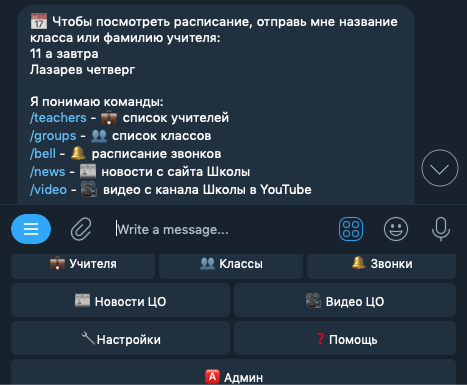

# co1858 Telegram Bot

Активно разрабатывался в 2015-2016 году как учебный проект, с целью научиться создавать ботов для Telegram.

Бот автоматически парсил и сохранял в Redis новости с сайта, видео с YouTube и расписание из электронного журнала МРКО, после чего к этому контенту можно было получить доступ через меню-клавиатуру или команды. Запланирован, но не реализован функционал подписок на обновления в разделах для автоматических уведомлений и возможность их настройки.

За время работы ботом воспользовались хотя бы раз около 200 сотрудников и учащихся Школы в Капотне (ЦО № 1858).

